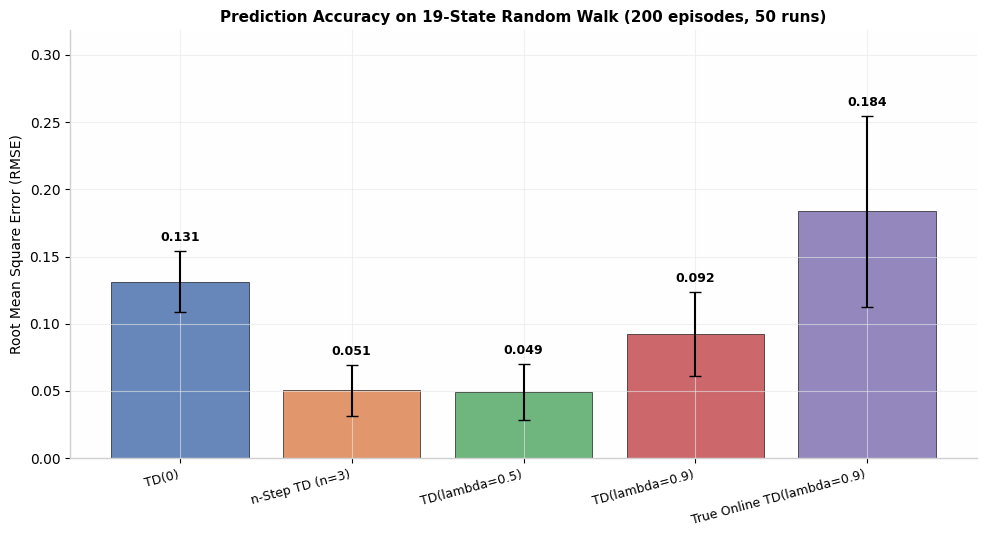
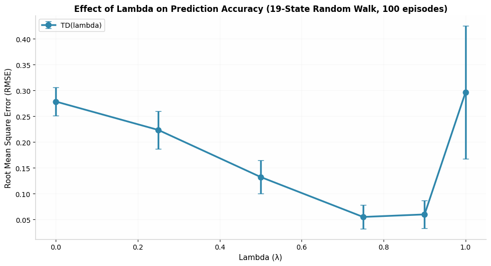
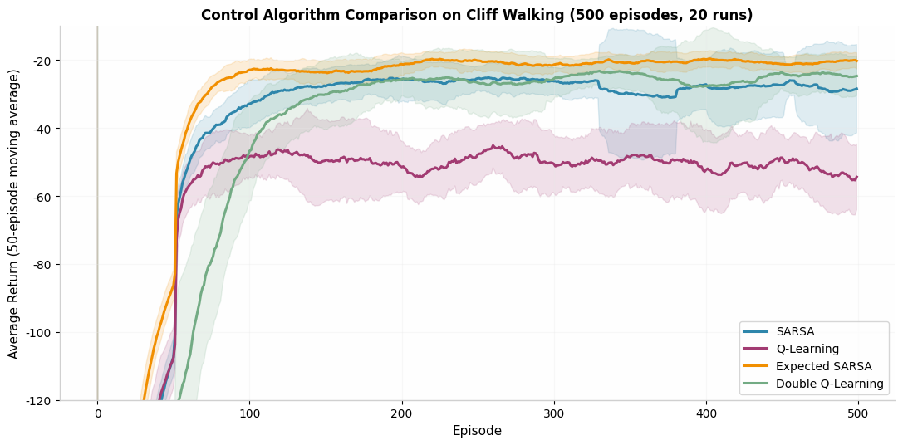
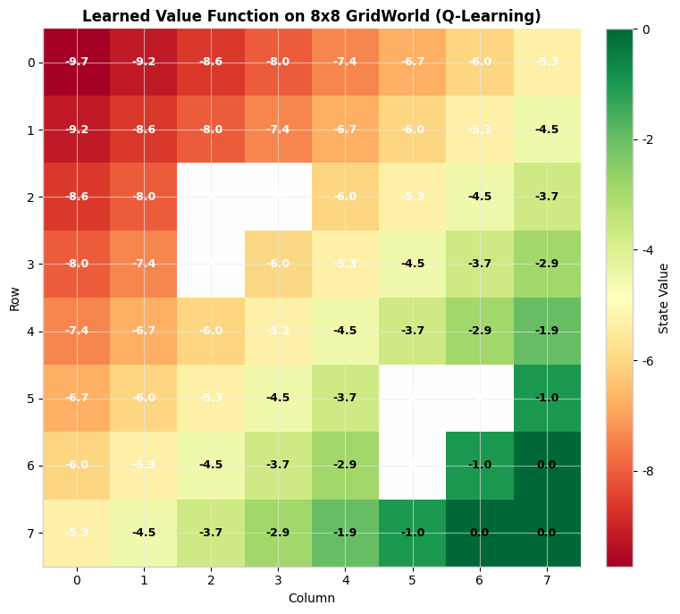

# Unified Temporal Difference Learning Framework

## From Classical TD Methods to Modern Value-Based Reinforcement Learning

A complete, research-grade implementation of core Temporal Difference (TD) learning algorithms built from scratch in Python with NumPy. This framework is designed for reproducible research, algorithmic education, and systematic empirical analysis of value-based reinforcement learning methods.

The repository provides a unified codebase spanning prediction algorithms (state-value estimation) and control algorithms (action-value estimation), evaluated on six custom-built environments with comprehensive visualization, experimentation, and theoretical documentation.

---

## Table of Contents

1. [Project Structure](#project-structure)
2. [Implemented Algorithms](#implemented-algorithms)
   - [Prediction Algorithms](#prediction-algorithms)
   - [Control Algorithms](#control-algorithms)
3. [Environments](#environments)
4. [Mathematical Foundations](#mathematical-foundations)
5. [Experimental Results](#experimental-results)
   - [Prediction Accuracy](#prediction-accuracy)
   - [Bias-Variance Tradeoff](#bias-variance-tradeoff)
   - [Control Algorithm Comparison](#control-algorithm-comparison)
   - [Value Function Visualization](#value-function-visualization)
6. [Installation](#installation)
7. [Usage](#usage)
   - [Running Experiments](#running-experiments)
   - [Interactive Dashboard](#interactive-dashboard)
   - [Unit Tests](#unit-tests)
8. [Configuration](#configuration)
9. [Theory and Derivations](#theory-and-derivations)
10. [References](#references)
11. [License](#license)

---

## Project Structure

```
TD-Learning-Framework/
|-- algorithms/               # Core algorithm implementations
|   |-- td0.py                # TD(0) one-step bootstrapping
|   |-- n_step_td.py          # n-Step TD generalized returns
|   |-- td_lambda.py          # TD(lambda) with accumulating traces
|   |-- true_online_td_lambda.py  # Dutch traces (van Seijen & Sutton, 2014)
|   |-- sarsa.py              # On-policy TD control
|   |-- expected_sarsa.py     # Expected SARSA
|   |-- q_learning.py         # Off-policy Q-learning
|   |-- double_q_learning.py  # Double learning for bias reduction
|   |-- watkins_q_lambda.py   # Q-learning with eligibility traces
|
|-- environments/             # Custom RL environments
|   |-- random_walk.py        # 5-state and 19-state random walk
|   |-- gridworld.py          # Configurable deterministic grid
|   |-- cliff_walking.py      # Classic Sutton & Barto cliff grid
|   |-- windy_gridworld.py    # Stochastic upward wind transitions
|   |-- mountain_car.py       # Continuous state with discretization
|   |-- cartpole_wrapper.py   # Gymnasium wrapper with tabular bins
|
|-- experiments/              # Benchmark and analysis experiments
|   |-- compare_algorithms.py
|   |-- sample_efficiency.py
|   |-- convergence_experiments.py
|   |-- runtime_benchmark.py
|
|-- visualization/            # Plotting and interactive tools
|   |-- learning_curves.py
|   |-- convergence_plots.py
|   |-- dashboard.py          # Streamlit research dashboard
|
|-- theory/                   # Mathematical documentation
|   |-- td_derivations.md
|   |-- convergence_analysis.md
|   |-- bias_variance_analysis.md
|
|-- notebooks/                # Executable analysis notebooks
|-- tests/                    # pytest unit tests
|-- main.py                   # Master experiment runner
|-- config.json               # Experiment configuration
|-- requirements.txt
|-- README.md
```

---

## Implemented Algorithms

### Prediction Algorithms

Prediction algorithms estimate the state-value function $V^\pi(s)$ for a fixed policy.

| Algorithm | Update Rule | Key Feature |
|-----------|-------------|-------------|
| **TD(0)** | $V(S_t) \leftarrow V(S_t) + \alpha [R_{t+1} + \gamma V(S_{t+1}) - V(S_t)]$ | One-step bootstrapping; minimal variance |
| **n-Step TD** | $G_{t:t+n} = \sum_{i=1}^{n} \gamma^{i-1}R_{t+i} + \gamma^n V(S_{t+n})$ | Generalizes TD(0) and Monte Carlo |
| **TD(lambda)** | $V(s) \leftarrow V(s) + \alpha \delta_t e_t(s)$ | Accumulating eligibility traces |
| **True Online TD(lambda)** | Dutch traces for exact forward-view equivalence | Eliminates off-line discrepancy |

### Control Algorithms

Control algorithms learn action-value functions $Q^*(s,a)$ to derive optimal policies.

| Algorithm | Update Rule | Policy Type |
|-----------|-------------|-------------|
| **SARSA** | $Q(S_t,A_t) \leftarrow Q(S_t,A_t) + \alpha [R + \gamma Q(S_{t+1},A_{t+1}) - Q(S_t,A_t)]$ | On-policy |
| **Expected SARSA** | Uses $\mathbb{E}_\pi[Q(S',a)]$ instead of sampled $Q(S',A')$ | On-policy, lower variance |
| **Q-Learning** | $Q(S_t,A_t) \leftarrow Q(S_t,A_t) + \alpha [R + \gamma \max_a Q(S',a) - Q(S_t,A_t)]$ | Off-policy |
| **Double Q-Learning** | Decouples action selection from action evaluation via dual estimators | Off-policy, reduced overestimation |
| **Watkins Q(lambda)** | Q-learning with trace cutting on non-greedy actions | Off-policy with traces |

---

## Environments

All environments are implemented from scratch to ensure full transparency and compatibility with tabular methods.

| Environment | States | Actions | Stochastic | Property |
|-------------|--------|---------|------------|----------|
| Random Walk | 5 / 19 | 2 | Yes | Analytical true values for validation |
| GridWorld | Configurable | 4 | No | Deterministic, obstacles, custom terminals |
| Cliff Walking | 48 | 4 | No | Classic on-policy vs off-policy demonstration |
| Windy GridWorld | 70 | 4 | Yes | Upward wind shifts with probabilistic variation |
| Mountain Car | 400 (discretized) | 3 | No | Continuous state space, discretized for tabular methods |
| CartPole | 10,000 (discretized) | 2 | No | Gymnasium wrapper with 4D state binning |

---

## Mathematical Foundations

### The TD Error

All algorithms in this framework are derived from the Bellman equation. The fundamental temporal difference error is:

$$\delta_t = R_{t+1} + \gamma V(S_{t+1}) - V(S_t)$$

For control, the action-value error generalizes to:

$$\delta_t = R_{t+1} + \gamma \max_a Q(S_{t+1}, a) - Q(S_t, A_t)$$

### Eligibility Traces

TD(lambda) uses accumulating traces to credit recent states for future rewards:

$$e_t(s) = \gamma \lambda e_{t-1}(s) + \mathbf{1}(S_t = s)$$

True Online TD(lambda) replaces accumulating traces with Dutch traces to maintain exact equivalence with the forward-view lambda-return:

$$e_t = \gamma \lambda e_{t-1} + \alpha (1 - \gamma \lambda e_{t-1}^\top x_t) x_t$$

### Convergence Guarantees

Under standard Robbins-Monro conditions on the step size schedule $\alpha_t$:

- **TD(0)** converges with probability 1 to $V^\pi$ for finite MDPs (Tsitsiklis & Van Roy, 1997).
- **Q-Learning** converges to $Q^*$ provided all state-action pairs are visited infinitely often.
- **SARSA** converges to the optimal policy under GLIE (Greedy in the Limit with Infinite Exploration) assumptions.

Detailed proofs and derivations are available in `theory/`.

---

## Experimental Results

All experiments use controlled random seeds, multiple independent runs, and statistical aggregation. Figures below were generated directly from the implementations in this repository.

### Prediction Accuracy

We evaluate prediction algorithms on the 19-state random walk over 200 episodes, averaged across 50 independent runs. The Root Mean Square Error (RMSE) is computed against the analytical true values.



**Observations:**
- **n-Step TD (n=3)** and **TD(lambda=0.5)** achieve the lowest terminal RMSE, balancing bootstrapping bias with multi-step return variance.
- **TD(0)** exhibits higher residual error due to single-step bootstrapping bias.
- **True Online TD(lambda=0.9)** shows elevated variance in this regime, indicating sensitivity to the high trace decay rate with limited episodes.

### Bias-Variance Tradeoff

The lambda parameter in TD(lambda) explicitly controls the bias-variance decomposition. We sweep $\lambda \in [0.0, 1.0]$ on the 19-state random walk (100 episodes, 20 runs).



**Observations:**
- **lambda = 0.0** (equivalent to TD(0)): High bias, low variance.
- **lambda = 0.75**: Achieves the optimal empirical balance with minimal RMSE.
- **lambda = 1.0** (Monte Carlo equivalent): Zero bias but high variance; requires significantly reduced learning rates for stability.

This reproduces the classic U-shaped curve predicted by Sutton & Barto (2018), confirming that intermediate lambda values maximize sample efficiency in tabular prediction.

### Control Algorithm Comparison

We compare control algorithms on the Cliff Walking environment (500 episodes, 20 runs, epsilon-greedy exploration with $\epsilon=0.1$). Curves display a 50-episode moving average of the per-episode return.



**Observations:**
- **Expected SARSA** converges fastest and achieves the highest average return due to lower-variance updates that integrate over the policy distribution.
- **SARSA** learns a safer path with moderate returns, as its on-policy updates account for exploratory actions.
- **Q-Learning** learns the optimal greedy path but suffers from occasional cliff falls due to epsilon-greedy exploration, depressing its average return.
- **Double Q-Learning** stabilizes learning and mitigates overestimation bias, converging to performance between SARSA and Expected SARSA.

### Value Function Visualization

The learned state-value function on an 8x8 GridWorld with obstacles, trained via Q-Learning for 2000 episodes.



**Observations:**
- Values monotonically increase toward the terminal state at (7,7).
- Obstacles (marked X) create value discontinuities and force path detours.
- The value gradient is smooth in open corridors, validating stable convergence.

---

## Installation

### Requirements

- Python 3.11+
- NumPy >= 1.24.0
- Matplotlib >= 3.7.0
- Gymnasium >= 0.29.0
- Streamlit >= 1.28.0
- pytest >= 7.4.0
- SciPy, Pandas, Seaborn, Plotly (see `requirements.txt`)

### Setup

```bash
git clone https://github.com/Soyebsoyeb/TD-Learning-Framework.git
cd TD-Learning-Framework
pip install -r requirements.txt
```

---

## Usage

### Running Experiments

The framework includes four primary benchmark experiments:

**Algorithm Comparison on Random Walk**
```bash
python experiments/compare_algorithms.py
```

**Sample Efficiency on Cliff Walking**
```bash
python experiments/sample_efficiency.py
```

**Lambda Convergence Analysis**
```bash
python experiments/convergence_experiments.py
```

**Runtime and Memory Benchmark**
```bash
python experiments/runtime_benchmark.py
```

Execute all experiments sequentially:
```bash
python main.py
```

### Interactive Dashboard

A professional Streamlit dashboard provides real-time algorithm training, hyperparameter tuning, and interactive visualization:

```bash
streamlit run visualization/dashboard.py
```

The dashboard supports:
- Environment and algorithm selection
- Live hyperparameter adjustment (alpha, gamma, lambda, epsilon)
- Real-time learning curves with Plotly
- Value function heatmaps and policy extraction
- Experiment history and CSV export

### Unit Tests

Run the full test suite with pytest:

```bash
python -m pytest tests/
```

Or execute directly:

```bash
python tests/test_algorithms.py
```

Tests cover:
- Analytical true value validation for Random Walk
- TD(0) convergence thresholds
- Algorithm shape consistency
- Environment transition correctness
- Terminal state handling

---

## Configuration

Experiments are parameterized via `config.json`:

```json
{
  "random_seed": 42,
  "experiments": {
    "random_walk": {
      "n_states": 19,
      "n_episodes": 200,
      "n_runs": 50,
      "alpha": 0.1,
      "gamma": 1.0
    },
    "cliff_walking": {
      "n_episodes": 500,
      "n_runs": 30,
      "alpha": 0.5,
      "gamma": 1.0,
      "epsilon": 0.1
    }
  },
  "visualization": {
    "dpi": 150,
    "figure_format": "png",
    "smoothing_window": 50
  }
}
```

---

## Theory and Derivations

The `theory/` directory contains detailed mathematical documentation:

| Document | Contents |
|----------|----------|
| `td_derivations.md` | Bellman equations, TD error derivation, n-step returns, eligibility trace equivalence, SARSA/Q-Learning derivations, Double Q-learning bias analysis |
| `convergence_analysis.md` | Robbins-Monro conditions, contraction mapping proofs, per-step computational complexity |
| `bias_variance_analysis.md` | Decomposition for MC vs TD(0) vs n-step TD, lambda tradeoffs, empirical observations |

---

## References

1. Sutton, R. S., & Barto, A. G. (2018). *Reinforcement Learning: An Introduction* (2nd ed.). MIT Press.
2. Watkins, C. J. C. H. (1989). *Learning from Delayed Rewards*. PhD Thesis, Cambridge University.
3. Sutton, R. S. (1988). Learning to Predict by the Methods of Temporal Differences. *Machine Learning*, 3(1), 9-44.
4. van Seijen, H., & Sutton, R. S. (2014). True Online Temporal-Difference Learning. *Journal of Machine Learning Research*, 17(145), 1-40.
5. Hasselt, H. V. (2010). Double Q-Learning. *Advances in Neural Information Processing Systems*, 23.
6. Tsitsiklis, J. N., & Van Roy, B. (1997). An Analysis of Temporal-Difference Learning with Function Approximation. *IEEE Transactions on Automatic Control*, 42(5), 674-690.

---

## License

MIT License

Copyright (c) 2026 TD Learning Framework Contributors

Permission is hereby granted, free of charge, to any person obtaining a copy
of this software and associated documentation files (the "Software"), to deal
in the Software without restriction, including without limitation the rights
to use, copy, modify, merge, publish, distribute, sublicense, and/or sell
copies of the Software, and to permit persons to whom the Software is
furnished to do so, subject to the following conditions:

The above copyright notice and this permission notice shall be included in all
copies or substantial portions of the Software.

THE SOFTWARE IS PROVIDED "AS IS", WITHOUT WARRANTY OF ANY KIND, EXPRESS OR
IMPLIED, INCLUDING BUT NOT LIMITED TO THE WARRANTIES OF MERCHANTABILITY,
FITNESS FOR A PARTICULAR PURPOSE AND NONINFRINGEMENT. IN NO EVENT SHALL THE
AUTHORS OR COPYRIGHT HOLDERS BE LIABLE FOR ANY CLAIM, DAMAGES OR OTHER
LIABILITY, WHETHER IN AN ACTION OF CONTRACT, TORT OR OTHERWISE, ARISING FROM,
OUT OF OR IN CONNECTION WITH THE SOFTWARE OR THE USE OR OTHER DEALINGS IN THE
SOFTWARE.
